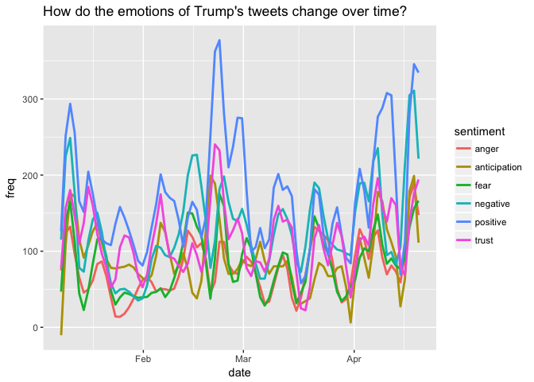
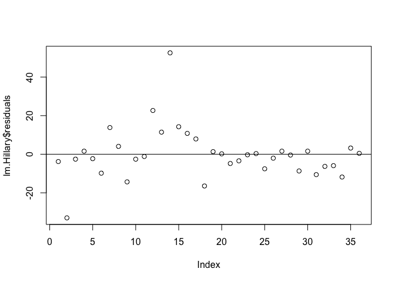
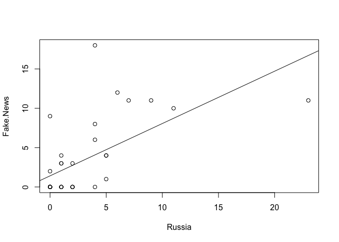
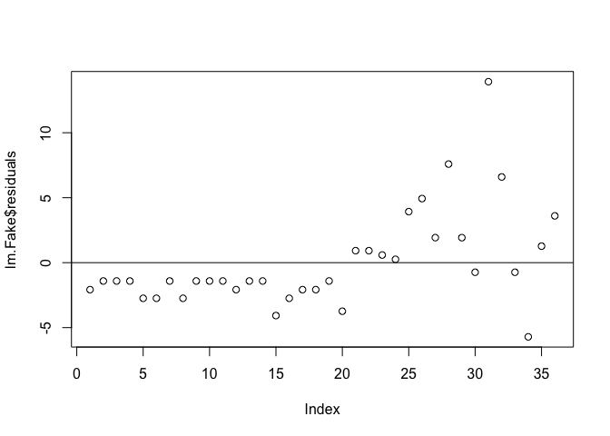

Trump’s Tweets
================
Elias M. Guerra
4/19/2018

We'll start by loading the necessary packages, loading the data, and rearranging it.

``` r
library(readr)
library(dplyr)
```

    ## Warning: package 'dplyr' was built under R version 3.4.2

    ## 
    ## Attaching package: 'dplyr'

    ## The following objects are masked from 'package:stats':
    ## 
    ##     filter, lag

    ## The following objects are masked from 'package:base':
    ## 
    ##     intersect, setdiff, setequal, union

``` r
library(stringr)
library(ggplot2)
library(tidyr)
```

    ## Warning: package 'tidyr' was built under R version 3.4.2

``` r
tt.anl <- read_csv("~/Documents/R/math311/TrumpTweets_Analysis.csv")
```

    ## Parsed with column specification:
    ## cols(
    ##   date = col_date(format = ""),
    ##   week = col_integer(),
    ##   month = col_integer(),
    ##   rt = col_logical(),
    ##   text = col_character(),
    ##   fn = col_logical(),
    ##   cnn = col_logical(),
    ##   nbc = col_logical(),
    ##   nyt = col_logical(),
    ##   fox = col_logical(),
    ##   russia = col_logical(),
    ##   obama = col_logical(),
    ##   ocare = col_logical(),
    ##   hc = col_logical(),
    ##   maga = col_logical(),
    ##   afinn = col_integer()
    ## )

``` r
tt.names.wide <- tt.anl %>%
  group_by(month) %>%
  summarize(Fake.News = sum(fn),
            CNN = sum(cnn),
            NBC = sum(nbc), 
            NYTimes = sum(nyt),
            Fox = sum(fox),
            Russia = sum(russia),
            Obama = sum(obama),
            Obamacare = sum(ocare),
            Hillary.Clinton = sum(hc),
            MAGA = sum(maga))
tt.names <- gather(tt.names.wide, key = "keyword", value = "freq", Fake.News:MAGA)
```

For starters we are going to look at how frequently Trump mentions these keywords we've picked out.

``` r
# Line graph
tt.names %>% # Ew...
  ggplot() + 
  geom_line(aes(x = month, y = freq, 
                color = keyword), size = .7, alpha = .7) +
  theme(axis.text.x = element_text(angle=60, hjust=1))
```


This graph is not very informative...

``` r
# Heat map 
ggplot(tt.names) + 
  geom_tile(aes(x = month, y = keyword, fill = freq)) +
  theme(axis.text.x = element_text(angle=60, hjust=1))
```


From here we can see some patterns. Just before the election Trump was tweeting very frequenctly about Hillary Clinton. And it looks like it might coincide with his tweeting "Make America Great Again". Let's take a look at the relationship.

``` r
# Clinton and MAGA
tt.names %>%
  filter(keyword %in% c("Hillary.Clinton", "MAGA")) %>%
  ggplot() + 
  geom_line(aes(x = month, y = freq, 
                color = keyword, 
                group = keyword), size = .7) +
  theme(axis.text.x = element_text(angle=60, hjust=1))
```


``` r
plot(Hillary.Clinton ~ MAGA, data = tt.names.wide)
lm.Hillary <- lm(Hillary.Clinton ~ MAGA, data = tt.names.wide)
abline(lm.Hillary)
```



``` r
summary(lm.Hillary)
```

    ## 
    ## Call:
    ## lm(formula = Hillary.Clinton ~ MAGA, data = tt.names.wide)
    ## 
    ## Residuals:
    ##     Min      1Q  Median      3Q     Max 
    ## -32.987  -6.023  -0.797   1.986  52.542 
    ## 
    ## Coefficients:
    ##             Estimate Std. Error t value Pr(>|t|)    
    ## (Intercept)   0.2871     3.4685   0.083    0.935    
    ## MAGA          1.3774     0.2922   4.714 4.02e-05 ***
    ## ---
    ## Signif. codes:  0 '***' 0.001 '**' 0.01 '*' 0.05 '.' 0.1 ' ' 1
    ## 
    ## Residual standard error: 13.51 on 34 degrees of freedom
    ## Multiple R-squared:  0.3953, Adjusted R-squared:  0.3775 
    ## F-statistic: 22.22 on 1 and 34 DF,  p-value: 4.02e-05

``` r
plot(lm.Hillary$residuals); abline(h = 0)
```



It looks like the relationship between the two is quite significant. The residuals looks decently normal.

``` r
# Heat map again
tt.names %>% filter(keyword != "Hillary.Clinton", keyword != "MAGA") %>%
  ggplot() + 
  geom_tile(aes(x = month, y = keyword, fill = freq)) +
  theme(axis.text.x = element_text(angle=60, hjust=1))
```


Looking at this heatmap again (without Clinton and MAGA) we can see some more relationships that stand out. Tweets about fake news became very frequent after Trump was elected. And they might coincide with his mentions of Russia. Let's test this.

``` r
# Fake News and Russia
tt.names %>%
  filter(keyword %in% c("Fake.News", "Russia")) %>%
  ggplot() + 
  geom_line(aes(x = month, y = freq, 
                color = keyword, 
                group = keyword), size = .7) +
  theme(axis.text.x = element_text(angle=60, hjust=1))
```


``` r
plot(Fake.News ~ Russia, data = tt.names.wide)
lm.Fake <- lm(Fake.News ~ Russia, data = tt.names.wide)
abline(lm.Fake)
```



``` r
summary(lm.Fake) 
```

    ## 
    ## Call:
    ## lm(formula = Fake.News ~ Russia, data = tt.names.wide)
    ## 
    ## Residuals:
    ##    Min     1Q Median     3Q    Max 
    ## -5.710 -2.077 -1.412  1.010 13.928 
    ## 
    ## Coefficients:
    ##             Estimate Std. Error t value Pr(>|t|)    
    ## (Intercept)   1.4118     0.7598   1.858   0.0718 .  
    ## Russia        0.6651     0.1455   4.572 6.12e-05 ***
    ## ---
    ## Signif. codes:  0 '***' 0.001 '**' 0.01 '*' 0.05 '.' 0.1 ' ' 1
    ## 
    ## Residual standard error: 3.798 on 34 degrees of freedom
    ## Multiple R-squared:  0.3807, Adjusted R-squared:  0.3625 
    ## F-statistic:  20.9 on 1 and 34 DF,  p-value: 6.122e-05

``` r
plot(lm.Fake$residuals); abline(h = 0)  
```



While the relationship does seem to be very significant the residuals are all over the place.

##### References

1.  The original data set of Trump's tweets come from <http://www.trumptwitterarchive.com/about>
