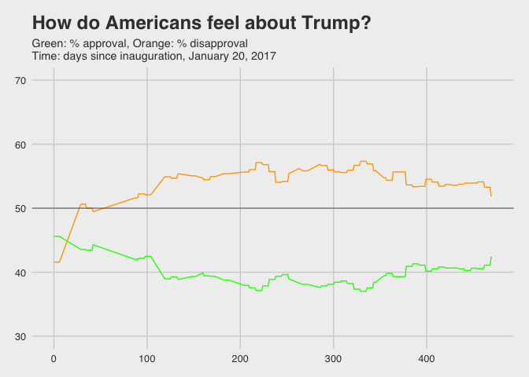

Trump’s Tweets
================
Elias M. Guerra
4/19/2018

We'll start by loading the necessary packages, loading the data, and rearranging it.

``` r
library(readr)
library(dplyr)
library(stringr)
library(ggplot2)
library(tidyr)
# 
# # Begin by cleaning the data
# # Step 1. Import the data
# tt <- read_csv("~/Documents/R/math311/trumptwitterarchive2016-2018.csv")
# # Step 2. Create columns with date, time, retweet (logical), and mentions (logical)
# str(tt)
# table(tt$source)
# tt$twitter <- str_detect(tt$source, "Twitter")
# tt$date <- substr(tt$created_at, 1, 10) %>% as.Date(format = "%m-%d-%Y")
#     date <- unique(tt$date)
#     Date <- data.frame(date = date, num = as.numeric(date))
#     Date <- Date[-777,]
#     Date$day <- Date$num - as.numeric(Date$num[Date$date == "2017-01-20"]) 
#     Date %>% filter(day >= 0) %>% arrange(day)
#     Date$week <- Date$day %/% 7
#     Date$month <- Date$day %/% 30
#     Date <- select(Date, date, week, month)
# tt <- left_join(tt, Date)
# tt$rt <- as.logical(tt$is_retweet)
# tt.final <- tt %>%
#   filter(twitter == T) %>%
#   select(date, week, month, rt, twitter, text)
# # Step 3. Save
# write_csv(tt.final, "~/Documents/R/math311/TrumpTweets16-18.csv")
# 
# 
# ## Correlate trumps ratings with his tweets
# # "Witchhunt"
# # Correlate different words
# 
# tt <- read_csv("~/Documents/R/math311/TrumpTweets16-18.csv")
# str(tt)
# tt.anl <- tt %>%
#   filter(!str_detect(text, "@realDonaldTrump"), twitter == T) %>%
#   select(date, week, month, rt, text) 
# tt.anl$fn <- 
#   str_detect(tt.anl$text, regex("fake news", ignore_case = T)) |
#   str_detect(tt.anl$text, regex("fakenews", ignore_case = T)) |
#   str_detect(tt.anl$text, regex("fake media", ignore_case = T))
# tt.anl$cnn <- str_detect(tt.anl$text, regex("cnn", ignore_case = T))
# tt.anl$nbc <- str_detect(tt.anl$text, regex("nbc", ignore_case = T))
# tt.anl$nbc <- str_detect(tt.anl$text, regex("nbc", ignore_case = T))
# tt.anl$nyt <- str_detect(tt.anl$text, regex("nytimes", ignore_case = T)) |
#   str_detect(tt.anl$text, regex("new york times", ignore_case = T))
# tt.anl$fox <- str_detect(tt.anl$text, regex("@fox", ignore_case = T)) |
#   str_detect(tt.anl$text, regex("@seanhannity", ignore_case = T)) |
#   str_detect(tt.anl$text, regex("@tuckercarlson", ignore_case = T))
# tt.anl$russia <- str_detect(tt.anl$text, regex("russia", ignore_case = T)) |
#   str_detect(tt.anl$text, regex("putin", ignore_case = T))
# tt.anl$obama <- str_detect(tt.anl$text, regex("obama", ignore_case = T)) & 
#   !str_detect(tt.anl$text, regex("obamacare", ignore_case = T))
# tt.anl$ocare <- str_detect(tt.anl$text, regex("obamacare", ignore_case = T))
# tt.anl$hc <- str_detect(tt.anl$text, regex("hillary", ignore_case = T)) |
#   str_detect(tt.anl$text, regex("clinton", ignore_case = T))
# tt.anl$maga <- str_detect(tt.anl$text, regex("maga", ignore_case = T)) |
#   str_detect(tt.anl$text, regex("make america", ignore_case = T))
# # Correlate different emotions with who trump is speaking about
# af <- get_sentiments("afinn")
# af.score <- NULL
# for (i in 1:nrow(tt.anl)) {
#   words <- tt.anl$text[i] %>%
#     str_split(" ", simplify = T) %>%
#     as.vector() %>%
#     str_replace(pattern = "[[:punct:]]", "")
#   score <- inner_join(data.frame(word = words), af, by = "word") 
#   score <- sum(score$score)
#   af.score[i] <- score
# }
# tt.anl$afinn <- af.score
# # Trump's approval ratings at time of tweet
# approval <- read_csv("~/Documents/R/math311/approval_topline.csv")
# # write_csv(tt.anl, "~/Documents/R/math311/TrumpTweets_Analysis.csv")

tt.anl <- read_csv("~/Documents/R/math311/TrumpTweets_Analysis.csv")
tt.names.wide <- tt.anl %>%
  group_by(month) %>%
  summarize(Fake.News = sum(fn),
            CNN = sum(cnn),
            NBC = sum(nbc), 
            NYTimes = sum(nyt),
            Fox = sum(fox),
            Russia = sum(russia),
            Obama = sum(obama),
            Obamacare = sum(ocare),
            Hillary.Clinton = sum(hc),
            MAGA = sum(maga))
tt.names <- gather(tt.names.wide, key = "keyword", value = "freq", Fake.News:MAGA)
```

For starters we are going to look at how frequently Trump mentions these keywords per month.

### What is Trump tweeting about?

``` r
# Line graph
tt.names %>% 
  ggplot() + 
  geom_line(aes(x = month, y = freq, 
                color = keyword), size = .7, alpha = .7) +
  theme(axis.text.x = element_text(angle=60, hjust=1)) +
  xlab("Time") +
  ylab("Tweets per month") +
  ggtitle("What is Trump tweeting about?", 
          subtitle = "Time 0 is inauguration January 20, 2017")
```


This graph is not very informative...

``` r
# Heat map 
ggplot(tt.names) + 
  geom_tile(aes(x = month, y = keyword, fill = freq)) +
  theme(axis.text.x = element_text(angle=60, hjust=1)) +
  ggtitle("What is Trump tweeting about?", 
          subtitle = "Time 0 is inauguration January 20, 2017") +
  xlab("Time") + labs(fill = "t/m")
```


From here we can see some patterns. Just before the election Trump was tweeting very frequenctly about Hillary Clinton. And it looks like it might coincide with his tweeting "Make America Great Again". Let's take a look at the relationship.

``` r
# Clinton and MAGA
tt.names %>%
  filter(keyword %in% c("Hillary.Clinton", "MAGA")) %>%
  ggplot() + 
  geom_line(aes(x = month, y = freq, 
                color = keyword, 
                group = keyword), size = .7) +
  theme(axis.text.x = element_text(angle=60, hjust=1)) +
  ggtitle('Tweets about Hillary Clinton and "Make America Great Again"') +
  xlab("Time") + ylab("Frequency") + labs(color = "")
```


I want to perform a least-squares regression. 1. Test assumptions:

-   Relationship between x and y is linear

-   Observations are independent (Not necessarily true)

-   Residuals are normally distributed with fixed σ

1.  

-   H\_0: B\_1(x) = 0

-   H\_a: B\_1(x) != 0

1.  

\*g(a,b) = ∑ from i = 1 to n (y\_i(a + bx\_i))^2

and choose a and b to minimize the sum of squared differences.

``` r
plot(Hillary.Clinton ~ MAGA, data = tt.names.wide)
title("Correlation between tweets about H. Clinton and 'MAGA'")
lm.Hillary <- lm(Hillary.Clinton ~ MAGA, data = tt.names.wide)
abline(lm.Hillary)
```


``` r
summary(lm.Hillary)
```

    ## 
    ## Call:
    ## lm(formula = Hillary.Clinton ~ MAGA, data = tt.names.wide)
    ## 
    ## Residuals:
    ##     Min      1Q  Median      3Q     Max 
    ## -32.987  -6.023  -0.797   1.986  52.542 
    ## 
    ## Coefficients:
    ##             Estimate Std. Error t value Pr(>|t|)    
    ## (Intercept)   0.2871     3.4685   0.083    0.935    
    ## MAGA          1.3774     0.2922   4.714 4.02e-05 ***
    ## ---
    ## Signif. codes:  0 '***' 0.001 '**' 0.01 '*' 0.05 '.' 0.1 ' ' 1
    ## 
    ## Residual standard error: 13.51 on 34 degrees of freedom
    ## Multiple R-squared:  0.3953, Adjusted R-squared:  0.3775 
    ## F-statistic: 22.22 on 1 and 34 DF,  p-value: 4.02e-05

``` r
plot(lm.Hillary$residuals); abline(h = 0)
```


1.  

-   The residuals look decently normal

-   Our results seem to ne very significant given such a low probability of seeing this relationship or one more extreme by chance (p = 4e-5).

``` r
# Heat map again
tt.names %>% filter(keyword != "Hillary.Clinton", keyword != "MAGA") %>%
  ggplot() + 
  geom_tile(aes(x = month, y = keyword, fill = freq)) +
  theme(axis.text.x = element_text(angle=60, hjust=1)) +
    ggtitle("What is Trump tweeting about?", 
          subtitle = "Time 0 is inauguration January 20, 2017") +
  xlab("Time") + labs(fill = "t/m")
```


Looking at this heatmap again (without Clinton and MAGA) we can see some more relationships that stand out. Tweets about fake news became very frequent after Trump was elected. And they might coincide with his mentions of Russia. Let's test this.

1.  Test assumptions:

-   Relationship between x and y is linear

-   Observations are independent (Not necessarily true)

-   Residuals are normally distributed with fixed σ

1.  

\*H\_0: B\_1(x) = 0

\*H\_a: B\_1(x) != 0

1.  

\*g(a,b) = ∑ from i = 1 to n (y\_i(a + bx\_i))^2

and choose a and b to minimize the sum of squared differences.

``` r
# Fake News and Russia
tt.names %>%
  filter(keyword %in% c("Fake.News", "Russia")) %>%
  ggplot() + 
  geom_line(aes(x = month, y = freq, 
                color = keyword, 
                group = keyword), size = .7) +
  theme(axis.text.x = element_text(angle=60, hjust=1)) +
  ggtitle('Tweets about fake news and Russia') +
  xlab("Time") + ylab("Frequency") +
  labs(color = "")
```


``` r
plot(Fake.News ~ Russia, data = tt.names.wide)
lm.Fake <- lm(Fake.News ~ Russia, data = tt.names.wide)
abline(lm.Fake)
```


``` r
summary(lm.Fake) 
```

    ## 
    ## Call:
    ## lm(formula = Fake.News ~ Russia, data = tt.names.wide)
    ## 
    ## Residuals:
    ##    Min     1Q Median     3Q    Max 
    ## -5.710 -2.077 -1.412  1.010 13.928 
    ## 
    ## Coefficients:
    ##             Estimate Std. Error t value Pr(>|t|)    
    ## (Intercept)   1.4118     0.7598   1.858   0.0718 .  
    ## Russia        0.6651     0.1455   4.572 6.12e-05 ***
    ## ---
    ## Signif. codes:  0 '***' 0.001 '**' 0.01 '*' 0.05 '.' 0.1 ' ' 1
    ## 
    ## Residual standard error: 3.798 on 34 degrees of freedom
    ## Multiple R-squared:  0.3807, Adjusted R-squared:  0.3625 
    ## F-statistic:  20.9 on 1 and 34 DF,  p-value: 6.122e-05

Our results seem to be very significant.

``` r
plot(lm.Fake$residuals); abline(h = 0)  
```


but the residuals are all over the place...

``` r
up.pred <- NULL
up.conf <- NULL
low.pred <- NULL
low.conf <- NULL
values <- seq(from = 0, to = 25, length = 100)
for (i in 1:100) {
  up.pred[i] <- predict.lm(lm.Fake, 
                           data.frame(Russia = values[i]), 
                           interval = "prediction")[3]
  low.pred[i] <- predict.lm(lm.Fake, 
                            data.frame(Russia = values[i]), 
                            interval = "prediction")[2]
  up.conf[i] <- predict.lm(lm.Fake, 
                           data.frame(Russia = values[i]), 
                           interval = "confidence")[3]
  low.conf[i] <- predict.lm(lm.Fake, 
                            data.frame(Russia = values[i]), 
                            interval = "confidence")[2]
}

plot(Fake.News ~ Russia, data = tt.names.wide)
title('Correlation between tweets about "Russia" and "Fake News"')
abline(lm.Fake, lwd = 1.5)
lines(up.pred ~ values, lty = 2)
lines(low.pred ~ values, lty = 2)
lines(up.conf ~ values, lty = 2, col = "red")
lines(low.conf ~ values, lty = 2, col = "red")
tts.cor <- NULL
set.seed(2)
for (i in 1:1000) {
  index <- sample(1:nrow(tt.names.wide), replace = T)
  tts <- tt.names.wide[index,]
  tts.lm <- lm(Fake.News ~ Russia, data = tts)
  tts.cor[i] <- tts.lm$coefficients[2]
  abline(tts.lm, lwd = .05, col = "red")
}
```


``` r
qq <- quantile(tts.cor, c(0.025, .957))
hist(tts.cor, main = NA, xlim = c(0,2))
title("Simulated slopes")
abline(v = qq[1], lty = 2)
abline(v = qq[2], lty = 2)
```


``` r
qq
```

    ##      2.5%     95.7% 
    ## 0.4663826 1.3737217

Wee can see that 95% of the simulated slopes are greater than 0 so there appears to be a significant relationship. But based on our residuals the relationship between tweets about Russia and fake news is not linear.

1.  In conclusion:

-   We will accept the alternative hypothesis: ß\_1 != 0.

-   A linear regression is likely not the best fit for our model.

### How does Trump feel about the news?

``` r
# Positive and negative
tt.afinn.hl <- tt.anl %>%
  gather(key = "name", value = "name.mention", fn:maga) %>%
  mutate(af.b0 = afinn < 0) %>%
  group_by(week, name, af.b0) %>%
  filter(name.mention == T) %>%
  summarize(af.hl = mean(afinn))
# All news orgs
tt.afinn.hl %>%
  filter(name %in% c("cnn", "fox", "nbc", "nyt")) %>%
  ggplot() +
  geom_line(aes(x = week, y = af.hl, color = name, linetype = af.b0)) +
  ggtitle("How does Trump feel about the news?", 
          subtitle = "Afinn dictionary scores by Finn Årup Nielsen\nMeans are of both positive and negative afinn scores") +
  xlab("Time (weeks)") + ylab("Mean of afinn score per week") +
  labs(name = "", linetype = "ignore me")
```



``` r
# Aggregated news orgs
tt.afinn.hl %>%
  filter(name %in% c("cnn", "fox", "nbc", "nyt")) %>%
  ggplot() +
  geom_line(aes(x = week, y = af.hl, linetype = af.b0)) +
  ggtitle("How does Trump feel about the news?", 
          subtitle = "Afinn dictionary scores by Finn Årup Nielsen\nMeans are of both positive and negative afinn scores") +
  xlab("Time (weeks)") + ylab("Mean of afinn score per week") +
  labs(name = "", linetype = "ignore me")
```


We're going to do a chi-square test of independence comparing the postive and negative afinn scores across aggregated news organizations.

##### References

1.  The original data set of Trump's tweets come from <http://www.trumptwitterarchive.com/about>

2.  Finn Årup Nielsen"A new ANEW: Evaluation of a word list for sentiment analysis in microblogs", Proceedings of the ESWC2011 Workshop on 'Making Sense of Microposts': Big things come in small packages 718 in CEUR Workshop Proceedings : 93-98. 2011 May. <http://arxiv.org/abs/1103.2903>
