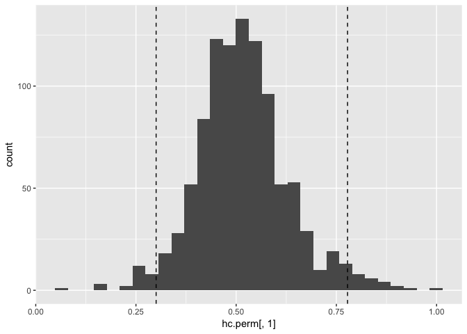
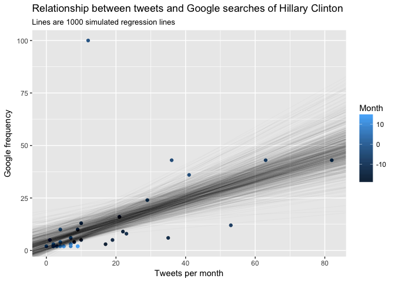
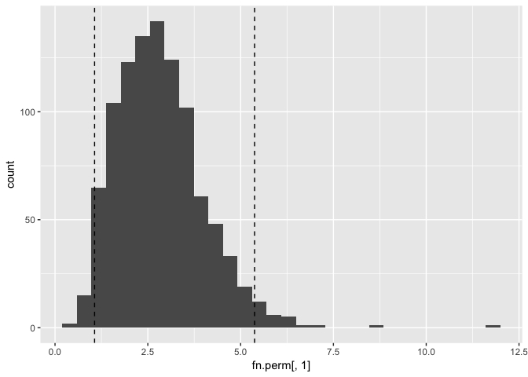
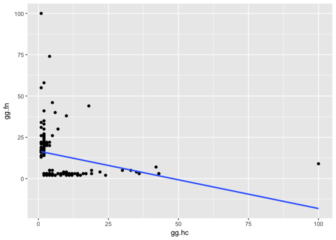
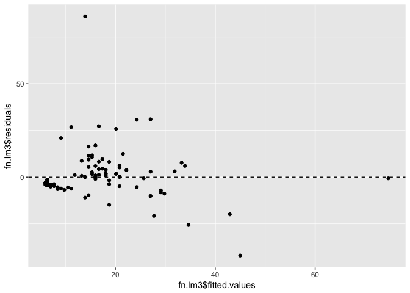
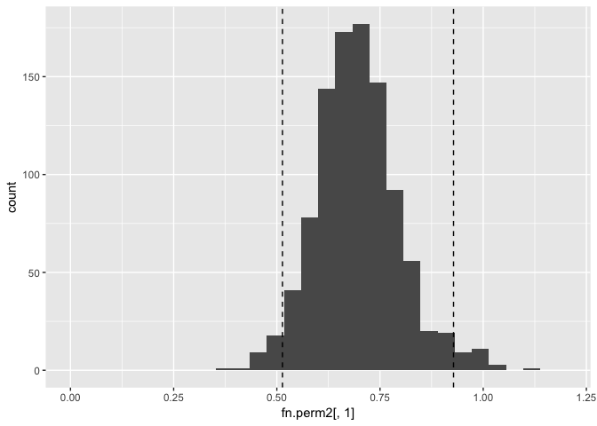

What is @realDonaldTrump tweeting?
================
May 2018

We'll start by loading the necessary packages, loading the data, and rearranging it. I also have two functions to make cleaning the data easier.

``` r
library(readr)
library(plyr)
library(dplyr)
library(stringr)
library(ggplot2)
library(tidyr)
library(knitr)
library(tidytext)
library(ggthemes)

DateToDays <- function(date = Sys.Date(), ref = "1995-01-15") {
# This function will convert dates into days from a reference date
# Default setttings will count days since my birthday
  # date = vector of dates
  # ref = reference date from which days will be counted
  date <- as.Date(as.character(date))
  date.df <- data.frame(Date = date, Numeric = as.numeric(date))
  date.df <- filter(date.df, !is.na(Numeric))
  ref.num <- as.numeric(as.Date(ref))
  date.df$day <- date.df$Numeric - ref.num
  Days <- date.df$day
  return(Days)
}

EveryDate <- function(dates, origin = "1970-01-01") {
# This function will fill in all missing in-between dates in a vector of dates
  # date = vector of incomplete dates
  dd <- as.numeric(range(dates))
  every.date <- as.Date(seq(dd[1], dd[2]), origin = origin)
  return(every.date)
}
```

This is the data that I downloaded from <http://www.trumptwitterarchive.com/>. I downloaded the data from June 16, 2015 to May 5, 2018. The starting date is when Donald Trump officially announced he was running for President.

``` r
# Begin by cleaning the data
# Step 1. Import the data
tt <- read_csv("~/Documents/R/math311/trumptwitterarchive2016-2018.csv")
# Step 2. Create columns with date, day, time, retweet (logical)
str(tt)
table(tt$source)
tt$twitter <- str_detect(tt$source, "Twitter")
tt$date <- substr(tt$created_at, 1, 10) %>% as.Date(format = "%m-%d-%Y")
tt <- filter(tt, !is.na(date))
tt$rt <- as.logical(tt$is_retweet)
tt.final <- tt %>%
  filter(twitter != F) %>%
  select(date, rt, text)
# Step 3. Save
# write_csv(tt.final, "~/Documents/R/math311/TrumpTweets16-18.csv")
```

``` r
# From TrumpTweets16-18 create TrumpTweets.Analysis
tt <- read_csv("~/Documents/R/math311/TrumpTweets16-18.csv")
str(tt)
tt$day <- DateToDays(tt$date, ref = "2017-01-20")
# Trump was inaugurated on January 20, 2017
tt$week <- tt$day %/% 7
tt$month <- tt$day %/% 30
# Months are not totally accurate because they are not all 30 days

# Emotional score for the words used
af <- get_sentiments("afinn")
af.score <- NULL
for (i in 1:nrow(tt)) {
  words <- tt$text[i] %>%
    str_split(" ", simplify = T) %>%
    as.vector() %>%
    str_replace(pattern = "[[:punct:]]", "")
  score <- inner_join(data.frame(word = words), af, by = "word")
  score <- sum(score$score)
  af.score[i] <- score
}
tt$afinn <- af.score

# Trump's approval ratings attached by week
approval <- read_csv("~/Documents/R/math311/approval_topline.csv")
approval$date <- as.Date(approval$modeldate, format = "%m/%d/%Y")
approval$day <- DateToDays(approval$date, ref = "2017-01-20")
approval$week <- approval$day %/% 7
approval$ap <- approval$approve_estimate
approval$dis <- approval$disapprove_estimate
ap <- approval %>% select(week, ap, dis)
tt <- left_join(tt, ap, by = "week")

# Remove extra columns
tt.anl <- tt %>%
  select(date, day, week, month, rt, afinn, ap, dis, text)
tt.anl <- 
tt.anl %>%
  group_by(text) %>%
  summarize(date = date[1], week = week[1], month = month[1], rt = rt[1], afinn = afinn[1], 
            ap = mean(ap),
            dis = mean(dis)
            )

# References to certain keywords: "fake news", "fox news", "Clinton", etc.
tt.anl$fn <-
  str_detect(tt.anl$text, regex("fake news", ignore_case = T)) |
  str_detect(tt.anl$text, regex("fakenews", ignore_case = T)) |
  str_detect(tt.anl$text, regex("fake media", ignore_case = T))
tt.anl$cnn <- str_detect(tt.anl$text, regex("cnn", ignore_case = T))
tt.anl$nbc <- str_detect(tt.anl$text, regex("nbc", ignore_case = T))
tt.anl$nyt <- str_detect(tt.anl$text, regex("nytimes", ignore_case = T)) |
  str_detect(tt.anl$text, regex("new york times", ignore_case = T))
tt.anl$fox <- str_detect(tt.anl$text, regex("@fox", ignore_case = T)) |
  str_detect(tt.anl$text, regex("@seanhannity", ignore_case = T)) |
  str_detect(tt.anl$text, regex("@tuckercarlson", ignore_case = T))
tt.anl$russia <- str_detect(tt.anl$text, regex("russia", ignore_case = T)) |
  str_detect(tt.anl$text, regex("putin", ignore_case = T))
tt.anl$hc <- str_detect(tt.anl$text, regex("hillary", ignore_case = T)) |
  str_detect(tt.anl$text, regex("clinton", ignore_case = T))
tt.anl$maga <- str_detect(tt.anl$text, regex("maga", ignore_case = T)) |
  str_detect(tt.anl$text, regex("make america", ignore_case = T))

# Google Trends
list.files("~/Documents/R/math311/") %>% str_subset("Google")
gg.hc <- read_csv("~/Documents/R/math311/GoogleTrends_HillaryClinton.csv", skip = 2)
gg.dt <- read_csv("~/Documents/R/math311/GoogleTrends_DonaldTrump.csv", skip = 2)
gg.ce <- read_csv("~/Documents/R/math311/GoogleTrends_ClintonEmail.csv", skip = 2)
gg.fn <- read_csv("~/Documents/R/math311/GoogleTrends_FakeNews.csv", skip = 2)
gg.rr <- read_csv("~/Documents/R/math311/GoogleTrends_TrumpRussia.csv", skip = 2)
gg <- cbind(gg.hc[,2], gg.dt[,2], gg.ce[,2], gg.fn[,2], gg.rr[,2])
colnames(gg) <- c("gg.hc", "gg.dt", "gg.ce",  "gg.fn", "gg.rr")
gg <- apply(gg, c(1,2), function(x) {if (x == "<1") x <- .5 else return(as.numeric(x))})
gg <- as_data_frame(gg)
gg$date <- gg.hc$Week
gg$day <- DateToDays(gg$date, ref = "2017-01-20")
gg$week <- gg$day %/% 7 
gg <- select(gg, week, gg.hc:gg.rr)
tt.anl <- left_join(tt.anl, gg, "week") 

# write_csv(tt.anl, "~/Documents/R/math311/TrumpTweets_Analysis.csv")
```

This last chunk will summarize the data set just created by month. It will be very useful throughout.

``` r
tt.anl  <- read_csv("~/Documents/R/math311/TrumpTweets_Analysis.csv")
tt.month <- tt.anl %>%
  group_by(month) %>%
  dplyr::summarize(tt.Total = length(month),
            tt.fn = sum(fn),
            tt.cnn = sum(cnn),
            tt.nbc = sum(nbc),
            tt.nyt = sum(nyt),
            tt.fox = sum(fox),
            tt.rr = sum(russia),
            tt.hc = sum(hc),
            tt.maga = sum(maga),
            gg.hc = max(gg.hc),
            gg.dt = max(gg.dt),
            gg.ce = max(gg.ce),
            gg.gn = max(gg.fn),
            gg.rr = max(gg.rr))
tt.month <- gather(tt.month, key = "tt.term", value = "tt.freq", tt.fn:tt.maga)
tt.month <- gather(tt.month, key = "gg.term", value = "gg.freq", gg.hc:gg.rr)
str(tt.month)
```

    ## Classes 'tbl_df', 'tbl' and 'data.frame':    1440 obs. of  6 variables:
    ##  $ month   : int  -20 -19 -18 -17 -16 -15 -14 -13 -12 -11 ...
    ##  $ tt.Total: int  147 630 273 286 383 406 312 211 296 326 ...
    ##  $ tt.term : chr  "tt.fn" "tt.fn" "tt.fn" "tt.fn" ...
    ##  $ tt.freq : int  0 0 0 0 0 0 0 0 0 0 ...
    ##  $ gg.term : chr  "gg.hc" "gg.hc" "gg.hc" "gg.hc" ...
    ##  $ gg.freq : num  NA 3 5 4 9 5 6 8 13 16 ...

Introduction
------------


Donald Trump became the 45th President of the United States on November 8, 2016 when he won the 2016 US presidential election. The official electoral votes were 304 to 227, but Clinton won the popular vote by 2.1%. Trump was inaugurated on January 20, 2017.

Trump's success took the world by surprise as a realtor turned reality TV star became the leader of the world's superpower. He campaigned on a populist message the appealed to many working-class, particularly older, white Americans, resentful after eight years of Barack Obama and the Democratic party. Since taking office Trump's presidency has been continually marked by provocative comments on both the national and international stage. Among other hallmarks of this presidency is his frequent use of the social media site Twitter. With over 50 million followers he instantly shares any thought, often to chagrin of his administration that must explain and apologize for his often outrageous and contradictory tweets.

Brendan Brown created <http://www.trumptwitterarchive.com/>, where he collects every tweet on Donald Trump's Twitter account. I decided to analyze some of the President's tweets.

Methods
-------

*Data set*

We've got a lot going on in this dataset,

1.  The timestamp, to which we've added days before and after inauguration

2.  The tweet itself

3.  The presence of certain key words and names: "fake news," CNN, NBC, NYTimes, Fox, Russia, Hillary Clinton, "Make America Great Again"

4.  The popularity of certain keywords from Google Trends during the relevant time period: Hillary Clinton, Donald Trump, "clinton email," "fake news," Russia

5.  Trump's approval ratings from FiveThirtyEight's aggregated ratings starting since his inauguration

6.  Sentiment scores from the Afinn dictionary: This linguistic dictionary has a integer value between -5 and 5 assigned to 2477 words and terms based on how negative or positive they are. Any words in a tweet that matched the dictionary were scored and summed to create a score for each tweet. Using the sum instead of the mean (which would provide the average sentiment of all relevant words) means that the number of positive or negative words is taken into account.

*Hypothesis testing and statistics*

Throughout this report we will be using a number of statistical tests. For each one we will define the statistic, the assumptions, the hypotheses, and later the conclusion from the results.

The first test is a least-square regression. For the following equation a and b values are chosen to minimize the sum squared distances between the points and the best fit line.

 = \sum_{i=1}^n (y_i - (a+bx_i))^2")

The test assumes that,

1.  The relationship between x and y is linear

2.  All x observations are independent

3.  The residuals are normally distributed with a fixed standard deviation, σ.

The hypotheses for this test are that for the function


If the last assumption does not hold true we will use the permutation test for independence of two variables. We will use this test to tell if the correlation is significant by permuting the correlation many times. From a given sample of size n from a population with two variables,

1.  Draw a permutation resample of size n without replacement from one of the variables; keep the other variable in its original order.

2.  Compute a statistic that measures the relationship, such as the correlation or slope.

3.  Repeat this resampling process.

4.  Calculate the p-value as the fraction of permuted statistics more extreme than the observed statistic.

The other test we will use is the chi-square test of homogeneity. The function below is used to calculate if there is a difference between two populations.

^2} {\text{expected}}")

This test assumes that,

1.  The variables being compared are categorical

2.  The data were collected using randomization

3.  All expected cell counts are greater than equal to 5. If this does not hold true we can use the permutation test of independence.

The hypothesis for this test is that for the respective values from each population there is no difference.


If the last assumption does not hold true we will use the two-sample permutation test. For each sample b and g,

1.  Pool the b and g values

2.  Resample b and g with the original samples sizes

3.  Calculate the chi-square statistic.

4.  Repeat steps 1 - 3 many times.

5.  Calculate the p-value as the fraction of times the random statistics exceed the original statistic.

Data
----

For starters we are just going to visualize this data set to get an idea of what's going on here.

1.  How often does Trump tweet about these key terms? We're going to measure the frequency in tweets per month. The key terms are inspired by <http://www.trumptwitterarchive.com/>.

``` r
# Heat map
ggplot(tt.month) +
  geom_tile(aes(x = month, y = tt.term, fill = tt.freq)) +
  theme(axis.text.x = element_text(angle=60, hjust=1)) +
  scale_y_discrete(labels = c("CNN", "Fake News", "Fox News", "Hillary Clinton", "MAGA", "NBC", "NYTimes", "Russia")) +
  ggtitle("What is Trump tweeting about?",
          subtitle = "Time 0 is inauguration, January 20, 2017") +
  xlab("Time (months)") + labs(fill = "t/m") +  ylab(NULL) 
```


1.  When do people Google issues related to the 2016 election? Frequency is out of 100 with 101 being the most frequent for the included time period. From Google Trends.

``` r
ggplot(tt.month) +
  geom_tile(aes(x = month, y = gg.term, fill = gg.freq)) +
  theme(axis.text.x = element_text(angle=60, hjust=1)) +
  scale_y_discrete(labels = c("clinton emails", "donald trump", "fake news", "hillary clinton", "trump russia")) + ylab(NULL) +
  ggtitle("What are people Googling?",
          subtitle = "Time 0 is inauguration, January 20, 2017") +
  xlab("Time (months)") + labs(fill = "Frequency") + ylab(NULL) 
```


1.  What emotions is Trump using in his tweets? Based on Afinn dictionary definitions.

``` r
tt.anl %>%
  mutate(day = DateToDays(date, ref = "2017-01-20")) %>% 
  group_by(day) %>%
  dplyr::summarize(afinn = sum(afinn)) %>% 
  ggplot() + geom_bar(aes(x = day, weight = afinn)) +
  ylab("Daily Afinn score") + xlab("Time (days)") +
  ggtitle("How does Trump feel on Twitter?",
          subtitle = "Time 0 is inauguration, January 20, 2017") 
```


1.  How does Trump's approval change over time?

``` r
library(ggthemes)
tt.anl %>%
  mutate(day = DateToDays(date, ref = "2017-01-20")) %>% 
  filter(!is.na(ap)) %>%
  ggplot() +
  geom_line(aes(x = day, y = ap), color = "green") +
  geom_line(aes(x = day, y= dis), color = "orange") +
  geom_hline(aes(yintercept = 50), size = .2) +
  ylim(c(30, 70)) +
  theme_fivethirtyeight() + 
  ylab("% Approval (green) / % Disapproval (orange)") + xlab("Time (days)") +
  ggtitle("How do Americans feel about Trump?", 
           subtitle = "Green: % approval, Orange: % disapproval \nTime: days since inauguration, January 20, 2017")
```


1.  How often does Trump tweet?

``` r
tt.anl %>%
  group_by(week) %>%
  summarize(freq = length(week), afinn = mean(afinn)) %>%
  ggplot() +
  geom_bar(aes(x = week, weight = freq)) + 
  ggtitle("When is Trump tweeting?", 
          subtitle = "Time 0 is inauguration, January 20, 2017") 
```


Analyses and Conclusions
------------------------

Use this for a multiple regression to check if increased frequency of terms is not just from increased frequency of tweets

### Are people's Google searches related to Donald Trump's tweets?

For starters, I am not trying to establish causation, simply an associaion.

From here we can see some patterns. Just before the election Trump was tweeting very frequenctly about Hillary Clinton. And it looks like it might coincide with his tweeting "Make America Great Again". Let's take a look at the relationship.

##### Tweets and Googles of Hillary Clinton

I want to perform a least-squares regression.

1.  Test assumptions:

-   Relationship between x and y is linear

-   Observations are independent (Not necessarily true)

-   Residuals are normally distributed with fixed σ

1.  


 \neq 0")

1.  

 = \sum_{i=1}^{n} y_i(a + bx_i))^2")

 Verify this ^

and choose a and b to minimize the sum of squared differences.

``` r
hc <- filter(tt.month, tt.term == "tt.hc", gg.term == "gg.hc", !is.na(gg.freq))
qplot(data = hc, x = tt.freq, y = gg.freq) + geom_smooth(method = "lm", se = F, color = "black")
```


``` r
lm.hc <- lm(gg.freq ~ tt.freq, data = hc)
summary(lm.hc)
```

    ## 
    ## Call:
    ## lm(formula = gg.freq ~ tt.freq, data = hc)
    ## 
    ## Residuals:
    ##     Min      1Q  Median      3Q     Max 
    ## -19.199  -5.585  -3.549   0.844  89.626 
    ## 
    ## Coefficients:
    ##             Estimate Std. Error t value Pr(>|t|)   
    ## (Intercept)   4.2794     4.0313   1.062  0.29639   
    ## tt.freq       0.5079     0.1599   3.177  0.00329 **
    ## ---
    ## Signif. codes:  0 '***' 0.001 '**' 0.01 '*' 0.05 '.' 0.1 ' ' 1
    ## 
    ## Residual standard error: 17.61 on 32 degrees of freedom
    ## Multiple R-squared:  0.2398, Adjusted R-squared:  0.216 
    ## F-statistic: 10.09 on 1 and 32 DF,  p-value: 0.003289

``` r
qplot(x = lm.hc$fitted.values, y = lm.hc$residuals) + geom_hline(aes(yintercept = 0), linetype = 2)
```


``` r
n <- 1000
hc.perm <- data.frame(ncol = 2, nrow = n)
colnames(hc.perm) <- c("ss", "ii")
for (i in 1:n) {
  index <- sample(1:nrow(hc), replace = T)
  ss <- hc[index,]
  ss.lm <- lm(gg.freq ~ tt.freq, data = ss)
  hc.perm[i,] <- rev(ss.lm$coefficients)
}
qq <- quantile(hc.perm$ss, c(.025, .975))
qplot(x = hc.perm[,1]) + geom_vline(aes(xintercept = qq), linetype = 2)
```

    ## `stat_bin()` using `bins = 30`. Pick better value with `binwidth`.


``` r
ggplot(hc, aes(x = tt.freq, y= gg.freq, color = month)) +
  geom_point() +
  geom_abline(data = hc.perm, aes(slope = ss, intercept = ii), alpha = .02) +
  ggtitle('') +
  xlab("Tweets per month") + ylab("Google frequency") + labs(color = "Month")
```


What happens when we remove don't look at posts between Hillary Clinton's Democratic nomination and the election. And if we do a multiple regression that also takes into account the amount of times that Trump tweets.

Hillary Clinton was nominated at the 2016 Democratic National Convention in Philadelphia on July 26, 2016, becoming the first woman to be nominated for president by a major U.S. political party (Wikipedia).

##### What's the deal with fake news? What is the correlation between tweets and google searches of "fake news"?

``` r
fn <- filter(tt.month, tt.term == "tt.fn", gg.term == "gg.gn", !is.na(gg.freq))
qplot(data = fn, x= tt.freq, y = gg.freq) + geom_smooth(method = "lm", se = F, color = "black")
```


``` r
lm.fn <- lm(gg.freq ~ tt.freq, data = fn)
summary(lm.fn)
```

    ## 
    ## Call:
    ## lm(formula = gg.freq ~ tt.freq, data = fn)
    ## 
    ## Residuals:
    ##    Min     1Q Median     3Q    Max 
    ## -36.20 -12.56 -10.56   3.50  73.85 
    ## 
    ## Coefficients:
    ##             Estimate Std. Error t value Pr(>|t|)   
    ## (Intercept)  15.5606     5.2313   2.975  0.00554 **
    ## tt.freq       2.6466     0.8884   2.979  0.00548 **
    ## ---
    ## Signif. codes:  0 '***' 0.001 '**' 0.01 '*' 0.05 '.' 0.1 ' ' 1
    ## 
    ## Residual standard error: 24.53 on 32 degrees of freedom
    ## Multiple R-squared:  0.2171, Adjusted R-squared:  0.1927 
    ## F-statistic: 8.875 on 1 and 32 DF,  p-value: 0.005478

``` r
qplot(x = lm.fn$fitted.values, y= lm.fn$residuals) + geom_hline(aes(yintercept = 0), linetype = 2)
```


``` r
n <- 1000
fn.perm <- data.frame(ncol = 2, nrow = n)
colnames(fn.perm) <- c("ss", "ii")
for (i in 1:n) {
  index <- sample(1:nrow(fn), replace = T)
  ss <- fn[index,]
  ss.lm <- lm(gg.freq ~ tt.freq, data = ss)
  fn.perm[i,] <- rev(ss.lm$coefficients)
}
qq <- quantile(fn.perm$ss, c(.025, .975))
qplot(x = fn.perm[,1]) + geom_vline(aes(xintercept = qq), linetype = 2)
```

    ## `stat_bin()` using `bins = 30`. Pick better value with `binwidth`.



``` r
ggplot(fn, aes(x = tt.freq, y= gg.freq, color = month)) +
  geom_point() +
  geom_abline(data = fn.perm, aes(slope = ss, intercept = ii), alpha = .02) +
  ggtitle('') +
  xlab("Tweets per month") + ylab("Google frequency") + labs(color = "Month")
```



##### Why are people Googling Fake News

``` r
why.fn <-
tt.anl %>%
  filter(!is.na(gg.fn)) %>%
  select(week, fn:gg.rr) %>%
  group_by(week) %>%
  summarize(tt.fn = sum(fn),
            tt.cnn = sum(cnn),
            tt.nbc = sum(nbc),
            tt.nyt = sum(nyt),
            tt.fox = sum(fox),
            tt.russia = sum(russia),
            tt.hc = sum(hc),
            tt.maga = sum(maga),
            gg.fn = max(gg.fn),
            gg.hc = max(gg.hc),
            gg.dt = max(gg.dt),
            gg.ce = max(gg.ce),
            gg.rr = max(gg.rr)
            )
fn.lm <- lm(data = why.fn, gg.fn ~ tt.fn + tt.cnn + tt.nbc + tt.nyt + tt.fox + tt.russia + tt.hc + tt.maga + gg.hc + gg.dt + gg.ce + gg.rr)
summary(fn.lm)
```

    ## 
    ## Call:
    ## lm(formula = gg.fn ~ tt.fn + tt.cnn + tt.nbc + tt.nyt + tt.fox + 
    ##     tt.russia + tt.hc + tt.maga + gg.hc + gg.dt + gg.ce + gg.rr, 
    ##     data = why.fn)
    ## 
    ## Residuals:
    ##     Min      1Q  Median      3Q     Max 
    ## -17.678  -4.509  -1.958   1.812  76.984 
    ## 
    ## Coefficients:
    ##             Estimate Std. Error t value Pr(>|t|)    
    ## (Intercept) 11.51636    2.62944   4.380 2.56e-05 ***
    ## tt.fn        1.56514    0.64719   2.418  0.01709 *  
    ## tt.cnn      -0.34420    0.29899  -1.151  0.25194    
    ## tt.nbc       0.15811    0.51813   0.305  0.76078    
    ## tt.nyt       0.38489    0.79661   0.483  0.62986    
    ## tt.fox      -0.36098    0.23444  -1.540  0.12625    
    ## tt.russia   -0.93047    0.52296  -1.779  0.07773 .  
    ## tt.hc       -0.10213    0.21317  -0.479  0.63272    
    ## tt.maga     -0.34906    0.38110  -0.916  0.36154    
    ## gg.hc       -0.45762    0.16890  -2.709  0.00773 ** 
    ## gg.dt        0.36113    0.16367   2.206  0.02926 *  
    ## gg.ce       -0.11628    0.07928  -1.467  0.14510    
    ## gg.rr        0.50500    0.08061   6.265 6.05e-09 ***
    ## ---
    ## Signif. codes:  0 '***' 0.001 '**' 0.01 '*' 0.05 '.' 0.1 ' ' 1
    ## 
    ## Residual standard error: 10.35 on 120 degrees of freedom
    ## Multiple R-squared:  0.5965, Adjusted R-squared:  0.5561 
    ## F-statistic: 14.78 on 12 and 120 DF,  p-value: < 2.2e-16

``` r
fn.lm2 <- lm(data = why.fn, gg.fn ~ gg.hc + gg.dt + gg.rr)
summary(fn.lm2)
```

    ## 
    ## Call:
    ## lm(formula = gg.fn ~ gg.hc + gg.dt + gg.rr, data = why.fn)
    ## 
    ## Residuals:
    ##     Min      1Q  Median      3Q     Max 
    ## -22.327  -5.129  -2.327   1.065  82.471 
    ## 
    ## Coefficients:
    ##             Estimate Std. Error t value Pr(>|t|)    
    ## (Intercept)  6.31955    1.60165   3.946  0.00013 ***
    ## gg.hc       -0.69650    0.13538  -5.145 9.72e-07 ***
    ## gg.dt        0.43202    0.16219   2.664  0.00872 ** 
    ## gg.rr        0.66816    0.06729   9.929  < 2e-16 ***
    ## ---
    ## Signif. codes:  0 '***' 0.001 '**' 0.01 '*' 0.05 '.' 0.1 ' ' 1
    ## 
    ## Residual standard error: 10.77 on 129 degrees of freedom
    ## Multiple R-squared:  0.5299, Adjusted R-squared:  0.519 
    ## F-statistic: 48.47 on 3 and 129 DF,  p-value: < 2.2e-16

``` r
qplot(y = gg.fn, x = gg.hc, data = why.fn) + geom_smooth(method = "lm", se = F)
```


``` r
qplot(y = gg.fn, x = gg.dt, data = why.fn) + geom_smooth(method = "lm", se = F)
```


``` r
qplot(y = gg.fn, x = gg.rr, data = why.fn) + geom_smooth(method = "lm", se = F)
```


And this is why graphs... It's immediately obvious that Google searches of Hillary Clinton and Donald Trump are totally independent of searches of "fake news". Searches of Russia and "fake news" are actually pretty closely associated. This might be because...

``` r
fn.lm3 <- lm(data = why.fn, gg.fn ~ gg.rr)
summary(fn.lm3)
```

    ## 
    ## Call:
    ## lm(formula = gg.fn ~ gg.rr, data = why.fn)
    ## 
    ## Residuals:
    ##     Min      1Q  Median      3Q     Max 
    ## -41.990  -4.043  -3.353   1.918  86.058 
    ## 
    ## Coefficients:
    ##             Estimate Std. Error t value Pr(>|t|)    
    ## (Intercept)   5.6627     1.3509   4.192 5.06e-05 ***
    ## gg.rr         0.6900     0.0725   9.517  < 2e-16 ***
    ## ---
    ## Signif. codes:  0 '***' 0.001 '**' 0.01 '*' 0.05 '.' 0.1 ' ' 1
    ## 
    ## Residual standard error: 11.99 on 131 degrees of freedom
    ## Multiple R-squared:  0.4088, Adjusted R-squared:  0.4043 
    ## F-statistic: 90.57 on 1 and 131 DF,  p-value: < 2.2e-16

``` r
qplot(x = fn.lm3$fitted.values, y = fn.lm3$residuals) + geom_hline(aes(yintercept = 0), linetype = 2)
```


``` r
n <- 1000
fn.perm2 <- data.frame(ncol = 2, nrow = n)
colnames(fn.perm2) <- c("ss", "ii")
for (i in 1:n) {
  index <- sample(1:nrow(why.fn), replace = T)
  ss <- why.fn[index,]
  ss.lm <- lm(data = ss, gg.fn ~ gg.rr)
  fn.perm2[i,] <- rev(ss.lm$coefficients)
}
qq <- quantile(fn.perm2$ss, c(.025, .975))
qplot(x = fn.perm2[,1]) + geom_vline(aes(xintercept = qq), linetype = 2) + xlim(c(0,1.2))
```



``` r
qplot(data = why.fn, x = gg.rr, y= gg.fn) +
  geom_abline(data = fn.perm2, aes(slope = ss, intercept = ii), alpha = .02)
```


How do we evaluate when we actually need a permutation test for a linear model?

##### Do Trump's tweets about Fox News differ significantly from other media sources based on sentiment score?

``` r
## Insert Afinn scores for tweets when news channel was mentioned else NA
tt.news <- select(tt.anl, cnn, nbc, nyt, fox, afinn, month, week)
tt.news$cnn[tt.news$cnn == T] <- tt.news$afinn[tt.news$cnn == T]
tt.news$cnn[tt.news$cnn == F] <- NA
tt.news$nbc[tt.news$nbc == T] <- tt.news$afinn[tt.news$nbc == T]
tt.news$nbc[tt.news$nbc == F] <- NA
tt.news$nyt[tt.news$nyt == T] <- tt.news$afinn[tt.news$nyt == T]
tt.news$nyt[tt.news$nyt == F] <- NA
tt.news$fox[tt.news$fox == T] <- tt.news$afinn[tt.news$fox == T]
tt.news$fox[tt.news$fox == F] <- NA
# Make n bins out range of Afinn scores
rr <- seq(range(tt.news$afinn)[1], range(tt.news$afinn)[2], by = 2)
N <- length(rr)
bb <- data_frame(min = rr, max = rr+1.999) # new bins
head(bb)
```

    ## # A tibble: 6 x 2
    ##     min     max
    ##   <dbl>   <dbl>
    ## 1   -84 -82.001
    ## 2   -82 -80.001
    ## 3   -80 -78.001
    ## 4   -78 -76.001
    ## 5   -76 -74.001
    ## 6   -74 -72.001

``` r
tail(bb)
```

    ## # A tibble: 6 x 2
    ##     min     max
    ##   <dbl>   <dbl>
    ## 1   202 203.999
    ## 2   204 205.999
    ## 3   206 207.999
    ## 4   208 209.999
    ## 5   210 211.999
    ## 6   212 213.999

``` r
# Count number of tweets within bins for each news outlet
cnn.af <- NULL
nbc.af <- NULL
nyt.af <- NULL
fox.af <- NULL
for (i in 1:N) {
  cnn.af[i] <- sum(tt.news$cnn > bb$min[i] & tt.news$cnn < bb$max[i], na.rm = T)
  nbc.af[i] <- sum(tt.news$nbc > bb$min[i] & tt.news$nbc < bb$max[i], na.rm = T)
  nyt.af[i] <- sum(tt.news$nyt > bb$min[i] & tt.news$nyt < bb$max[i], na.rm = T)
  fox.af[i] <- sum(tt.news$fox > bb$min[i] & tt.news$fox < bb$max[i], na.rm = T)
}
# Combine and plot
bb <- cbind(bb, cnn.af, nbc.af, nyt.af, fox.af)
colnames(bb) <- c("min", "max", "cnn", "nbc", "nyt", "fox")
bb <- bb %>% select(min, max, cnn, nbc, nyt, fox)
filter(bb, min >= -15, min <= 15)
```

    ##    min     max cnn nbc nyt fox
    ## 1  -14 -12.001   0   0   0   0
    ## 2  -12 -10.001   1   0   0   0
    ## 3  -10  -8.001   2   1   0   2
    ## 4   -8  -6.001   3   0   0   3
    ## 5   -6  -4.001   7   2   3   7
    ## 6   -4  -2.001  20   7   9  24
    ## 7   -2  -0.001  10   9  12  32
    ## 8    0   1.999  16   7   3  16
    ## 9    2   3.999  18  13   1  37
    ## 10   4   5.999  12   0   1  11
    ## 11   6   7.999   3   0   1   9
    ## 12   8   9.999   2   1   0   5
    ## 13  10  11.999   1   0   0   3
    ## 14  12  13.999   5   2   0   6
    ## 15  14  15.999   2   1   0   3

``` r
bb <- filter(bb, min >= -6, min <= 8)
# We do not want two news orgs with 0 tweets in a bin
# This will screw up the chi-square test later
# And we don't care about outliers anyway
bb
```

    ##   min    max cnn nbc nyt fox
    ## 1  -6 -4.001   7   2   3   7
    ## 2  -4 -2.001  20   7   9  24
    ## 3  -2 -0.001  10   9  12  32
    ## 4   0  1.999  16   7   3  16
    ## 5   2  3.999  18  13   1  37
    ## 6   4  5.999  12   0   1  11
    ## 7   6  7.999   3   0   1   9
    ## 8   8  9.999   2   1   0   5

``` r
bb %>%
  gather(key = "news", value = "value", cnn:fox) %>%
  ggplot() +
  geom_bar(aes(x = as.factor(min), weight = value, fill = news), position = "dodge") +
  theme(axis.text.x = element_text(angle=45, hjust=1)) +
  labs(fill = NULL) + xlab("Afinn scores") + ylab("Total tweets") +
  scale_fill_ptol(labels = c("CNN", "Fox", "NBC", "NYTimes")) 
```



Clearly Trump is tweeting the most about Fox News. To account for the fact that he tweets about certain news organizations more than others we'll convert the frequency of tweets to the proportion of tweets that fall into ranges of Afinn scores.

``` r
bb2 <- bb
bb2$cnn <- bb2$cnn/sum(bb2$cnn) * 100
bb2$nbc <- bb2$nbc/sum(bb2$nbc) * 100
bb2$nyt <- bb2$nyt/sum(bb2$nyt) * 100
bb2$fox <- bb2$fox/sum(bb2$fox) * 100
## Calculate as proportion of tweets
bb2
```

    ##   min    max       cnn       nbc       nyt       fox
    ## 1  -6 -4.001  7.954545  5.128205 10.000000  4.964539
    ## 2  -4 -2.001 22.727273 17.948718 30.000000 17.021277
    ## 3  -2 -0.001 11.363636 23.076923 40.000000 22.695035
    ## 4   0  1.999 18.181818 17.948718 10.000000 11.347518
    ## 5   2  3.999 20.454545 33.333333  3.333333 26.241135
    ## 6   4  5.999 13.636364  0.000000  3.333333  7.801418
    ## 7   6  7.999  3.409091  0.000000  3.333333  6.382979
    ## 8   8  9.999  2.272727  2.564103  0.000000  3.546099

``` r
bb2 %>%
  gather(key = "news", value = "value", cnn:fox) %>%
  ggplot() +
  geom_bar(aes(x = as.factor(min), weight = value, fill = news), position = "dodge") +
  theme(axis.text.x = element_text(angle=45, hjust=1)) +
  labs(fill = NULL) + xlab("Afinn scores") + ylab("% of tweets") +
  scale_fill_ptol(labels = c("CNN", "Fox", "NBC", "NYTimes")) 
```



We can immediately see that as proportions that

``` r
cc <- cbind(c(3,3,3,4,4,5),c(4,5,6,5,6,6))
for (i in 1:6) {
  ii <- cc[i,]
  bb.s <- as.matrix(bb2[,c(ii)])
  bb.s
  gg <- bb.s %>%
    data.frame %>%
    mutate(afinn = bb2$min) %>%
    gather(key = "news", value = "value", colnames(.)[1:2]) %>%
    ggplot() + geom_bar(aes(x= afinn, weight = value, fill = news), position = "dodge") + 
    scale_fill_ptol()
  rownames(bb.s) <- bb2$min
  chi <- chisq.test(bb.s)
  print(colnames(bb.s))
  print(rbind(X.squared = as.numeric(chi$statistic),
              p.val = as.numeric(chi$p.value)))
  print(gg)
}
```

    ## [1] "cnn" "nbc"
    ##                   [,1]
    ## X.squared 2.530384e+01
    ## p.val     6.701905e-04



    ## [1] "cnn" "nyt"
    ##                   [,1]
    ## X.squared 4.042883e+01
    ## p.val     1.041897e-06


    ## [1] "cnn" "fox"
    ##                 [,1]
    ## X.squared 10.3499203
    ## p.val      0.1695957


    ## [1] "nbc" "nyt"
    ##                   [,1]
    ## X.squared 4.517502e+01
    ## p.val     1.264676e-07


    ## [1] "nbc" "fox"
    ##                  [,1]
    ## X.squared 16.70438566
    ## p.val      0.01940509


    ## [1] "nyt" "fox"
    ##                   [,1]
    ## X.squared 3.417845e+01
    ## p.val     1.594938e-05


The warnings have been silenced but R would warn the Chi-squared test may be incorrect, likely because some the expected values are less than 5.

``` r
chi <- chisq.test(bb2[,c(5,6)])
```

    ## Warning in chisq.test(bb2[, c(5, 6)]): Chi-squared approximation may be
    ## incorrect

``` r
chi$expected
```

    ##            nyt       fox
    ## [1,]  7.482270  7.482270
    ## [2,] 23.510638 23.510638
    ## [3,] 31.347518 31.347518
    ## [4,] 10.673759 10.673759
    ## [5,] 14.787234 14.787234
    ## [6,]  5.567376  5.567376
    ## [7,]  4.858156  4.858156
    ## [8,]  1.773050  1.773050

This is actually the case for every test so we are going to have to run them with permutations.

``` r
# This function will perform a permutation test for independence for two news agencies
# It requires the X-squared statistic from the chi-squared test
# and n number of permutations
PermForNews <- function(a, b, x.sq, n) {
chi <- NULL
bb.gg <- gather(bb2, "news", "af", cnn:fox)
for (i in 1:n) {
  bb.s <- bb.gg[bb.gg$news %in% c(a,b),]
  bb.s$af <- sample(bb.s$af, replace = F)
  bb.s <- spread(bb.s, news, af)[,3:4]
  chi[i] <- chisq.test(bb.s)$statistic
}
chi <- chi[!is.na(chi)]
return(chi)
}
```

``` r
## CNN and NBC
xsq1 <- 2.530384e+01
news.perm <- PermForNews("cnn","nbc",x.sq = xsq1, n = 1000)
sum(news.perm<xsq1)/length(news.perm)
```

    ## [1] 0.03308431

``` r
## CNN and NYTimes
xsq2 <- 4.042883e+01
news.perm <- PermForNews("cnn","nyt",x.sq = xsq2, n = 1000)
sum(news.perm<xsq2)/length(news.perm)
```

    ## [1] 0.218

``` r
## CNN and Fox
xsq3 <- 10.3499203
news.perm <- PermForNews("cnn","fox",x.sq = xsq3, n = 1000)
sum(news.perm<xsq3)/length(news.perm)
```

    ## [1] 0.017

``` r
## NBC and NYTimes
xsq4 <- 4.517502e+01
news.perm <- PermForNews("nbc","nyt",x.sq = xsq4, n = 1000)
sum(news.perm<xsq4)/length(news.perm)
```

    ## [1] 0.06733167

``` r
## NBC and Fox
xsq5 <- 16.70438566
news.perm <- PermForNews("nbc","fox",x.sq = xsq5, n = 1000)
sum(news.perm<xsq5)/length(news.perm)
```

    ## [1] 0.003289474

``` r
## NYTimes and Fox
xsq6 <- 3.417845e+01
news.perm <- PermForNews("nyt","fox",x.sq = xsq6, n = 1000)
sum(news.perm<xsq6)/length(news.perm)
```

    ## [1] 0.128

##### References

1.  The original data set of Trump's tweets come from <http://www.trumptwitterarchive.com/>

2.  Finn Årup Nielsen"A new ANEW: Evaluation of a word list for sentiment analysis in microblogs", Proceedings of the ESWC2011 Workshop on 'Making Sense of Microposts': Big things come in small packages 718 in CEUR Workshop Proceedings : 93-98. 2011 May. <http://arxiv.org/abs/1103.2903>

3.  *Yihui* left a really helpful comment for Latex support in RMarkdown on Github: <https://github.com/rstudio/rmarkdown/issues/1187>
